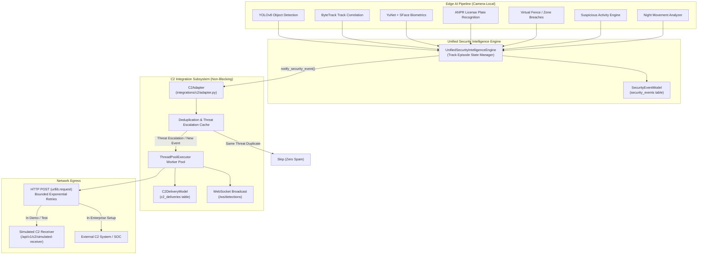
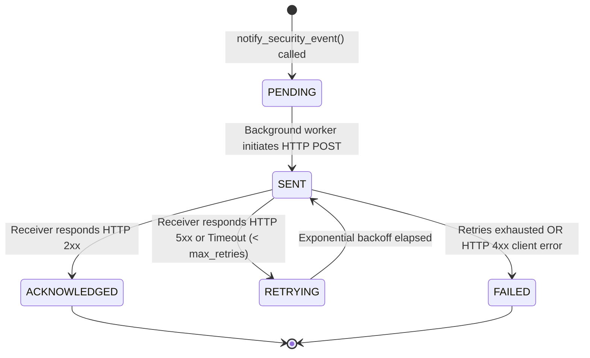

# Command & Control (C2) Integration Architecture

> **DISCLAIMER & DEMO NOTICE**
> 
> The IBVAP Command & Control (C2) Integration layer is an experimental, vendor-neutral research and demonstration prototype built for the Smart India Hackathon (SIH). It is designed to demonstrate standard event egress capabilities from an edge video analytics platform.
> 
> **THIS SYSTEM IS NOT CONNECTED TO ANY REAL DEFENSE, MILITARY, POLICE, BORDER FORCE, OR GOVERNMENT COMMAND & CONTROL INFRASTRUCTURE.**
> 
> All outbound event targets default to disabled autonomous edge mode (`C2_INTEGRATION_ENABLED=false`). When enabled for testing, events are directed to local simulated receivers or user-specified sandbox endpoints.

---

## 1. Overview & Objective

The **Command & Control (C2) Integration Layer** extends the IBVAP Unified Threat & Event Intelligence system by providing standardized, vendor-neutral, outbound event publishing capabilities.

In autonomous edge deployments, IBVAP operates fully air-gapped without external dependencies. When deployed as part of an integrated security architecture, this integration layer enables IBVAP to dispatch enriched security events to higher-echelon command centers in real time.

### Key Architectural Principles

1. **Consumer, Not Dependency**: The C2 integration is strictly an event consumer. Surveillance and edge inference operations (YOLOv8, ByteTrack, YuNet, SFace, ANPR, Virtual Fence, Suspicious Activity, Night Movement) continue with zero interruption even if C2 is disabled, misconfigured, unreachable, or crashing.
2. **Asynchronous & Non-Blocking**: Dispatches execute in an isolated background thread worker pool (`ThreadPoolExecutor`). Edge frame inference latency is never impacted.
3. **Smart Deduplication & Escalation**: Prevents message flooding by tracking event threat levels. Events are only re-dispatched if the subject's threat level escalates (e.g. `LOW` -> `HIGH`).
4. **Transparent Audit Logging**: Every dispatch attempt, HTTP response code, error detail, and acknowledgment timestamp is recorded in the additive SQLite `c2_deliveries` database table.
5. **No AI Model Modifications**: Zero changes to existing neural network weights, feature extractors, tracking filters, or edge detection algorithms.

---

## 2. Architecture & Data Flow



---

## 3. Configuration Reference

The integration layer is governed by environment variables configured in `backend/config.py` and `.env`:

| Setting | Type | Default | Description |
| :--- | :--- | :--- | :--- |
| `C2_INTEGRATION_ENABLED` | Boolean | `false` | Master toggle. When `false`, IBVAP operates in autonomous edge mode. Outbound calls return immediately without queueing. |
| `C2_ENDPOINT` | String | `""` | Destination HTTP POST URL for external C2 ingest or simulated receiver. |
| `C2_API_KEY` | String | `""` | Optional Bearer authorization token sent in `Authorization: Bearer <key>` header. |
| `C2_TIMEOUT_SECONDS` | Float | `5.0` | Maximum socket timeout per HTTP delivery attempt. Prevents thread starvation. |
| `C2_MAX_RETRIES` | Integer | `3` | Maximum retry attempts upon transient HTTP 5xx errors or connection timeouts. |

---

## 4. Outbound Event Schema Contract

Outbound events strictly follow a vendor-neutral schema (Section 7 specification). No fake, mock, or fabricated fields are emitted:

```json
{
  "event_id": "c2-evt-4f12a8b9c1d0",
  "source": "IBVAP",
  "security_event_id": "SEC-EVT-CAM07-TRK42-9812",
  "timestamp": "2026-09-06T14:15:30.124Z",
  "event_type": "SECURITY_EVENT",
  "subject_type": "human",
  "threat": {
    "level": "high",
    "score": 85,
    "primary_factor": "Unknown individual crossed perimeter fence during darkness"
  },
  "contributing_signals": [
    "ZONE_INTRUSION",
    "NIGHT_MOVEMENT",
    "UNKNOWN_FACE"
  ],
  "location": {
    "camera_id": "BORDER-CAM-07",
    "camera_name": "Border Cam 07",
    "zone_name": "Perimeter Buffer Zone Alpha"
  },
  "subject": {
    "track_id": 42,
    "track_label": "TRK#42",
    "identity": {
      "status": "UNKNOWN",
      "person_name": null,
      "confidence": null
    },
    "vehicle": null
  },
  "related_incidents": [
    "INC-ZF-20260906-8A3F1",
    "INC-NM-20260906-9C4B2"
  ],
  "evidence_snapshots": [
    "/storage/evidence/INC-ZF-20260906-8A3F1_snapshot.jpg"
  ],
  "is_test": false
}
```

For vehicle detections, `subject` provides vehicle classification and verified license plate reads:

```json
{
  "subject": {
    "track_id": 105,
    "track_label": "VTRK#105",
    "identity": null,
    "vehicle": {
      "class": "truck",
      "plate": "JK-02-AB-9812",
      "format_valid": true
    }
  }
}
```

---

## 5. Delivery Lifecycle & State Machine



### Audit Database Table (`c2_deliveries`)

| Column | Type | Description |
| :--- | :--- | :--- |
| `id` | VARCHAR(36) | Primary Key UUID for the delivery attempt |
| `security_event_id` | VARCHAR(64) | Originating `security_event_id` |
| `event_type` | VARCHAR(32) | Type identifier (`SECURITY_EVENT`) |
| `status` | VARCHAR(20) | `PENDING`, `SENT`, `ACKNOWLEDGED`, `FAILED`, `SKIPPED` |
| `attempt_count` | INTEGER | Number of HTTP delivery attempts made |
| `last_attempt_at` | DATETIME | Timestamp of most recent transmission attempt |
| `acknowledged_at` | DATETIME | Timestamp when receiver acknowledged delivery |
| `response_status` | INTEGER | HTTP response status code (e.g. 200, 500) |
| `error_message` | TEXT | Recorded diagnostic message or stack summary |
| `payload` | JSON | Complete snapshot of outbound JSON document dispatched |
| `created_at` | DATETIME | Initial record creation timestamp |
| `updated_at` | DATETIME | Last state transition timestamp |

---

## 6. Deduplication & Threat Escalation Rules

Surveillance feeds process 25–30 frames per second. If a subject remains visible across multiple seconds, duplicate event spam is prevented via state ranking:

1. **First Sighting**: Dispatches initial event and caches current threat rank.
2. **Subsequent Frames (Same Threat)**: If `threat_level` remains unchanged (e.g. remains `medium`), delivery is skipped.
3. **Threat Escalation (e.g., `medium` -> `high`)**: If new signals appear (e.g. face identified as unknown, or subject breached a restricted zone), the threat level increases. The adapter detects this escalation and immediately dispatches an updated event.
4. **De-escalation / Normal Updates**: Lower threat updates are suppressed to prioritize operator focus on escalating security situations.

---

## 7. Simulated C2 Receiver (Development & Demo Harness)

For offline testing, hackathon demonstrations, and automated CI pipelines, IBVAP includes a built-in development receiver:

- **Endpoint**: `POST /api/v1/c2/simulated-receiver`
- **Behavior**: Validates contract structure, logs received payload, and returns HTTP 200 with an acknowledgment identifier.
- **Audit Inspection**: `GET /api/v1/c2/simulated-receiver/received` retrieves recent events received by the harness.

### Sample Request
```bash
curl -X POST http://localhost:8000/api/v1/c2/simulated-receiver \
  -H "Content-Type: application/json" \
  -d '{"event_id": "c2-test-01", "source": "IBVAP", "threat": {"level": "high", "score": 85}}'
```

### Sample Response
```json
{
  "status": "acknowledged",
  "ack_id": "sim-ack-3c829e01f4",
  "event_id": "c2-test-01",
  "received_at": "2026-09-06T14:20:00.000Z"
}
```

---

## 8. REST API Catalogue

All C2 endpoints are registered under both `/api/v1/c2` and `/api/c2`:

| Method | Endpoint | Description |
| :--- | :--- | :--- |
| `GET` | `/api/v1/c2/status` | Runtime configuration, connection status, and telemetry counters |
| `GET` | `/api/v1/c2/events` | Paginated delivery audit log with optional status filtering |
| `GET` | `/api/v1/c2/events/{id}` | Full detail and payload of a specific delivery record |
| `POST` | `/api/v1/c2/test-event` | Generates and dispatches a simulated test event |
| `POST` | `/api/v1/c2/simulated-receiver` | Test harness receiver returning immediate ACK |
| `GET` | `/api/v1/c2/simulated-receiver/received` | In-memory log of events captured by test harness |

---

## 9. Operator Dashboard Visibility

The UI presents real-time integration status without mock or fabricated success indicators:

- **Command Overview Strip**:
  - Located prominently below top metric cards.
  - Displays mode: `DISABLED (AUTONOMOUS EDGE MODE)` or `CONNECTED`.
  - Displays endpoint target, delivered counter, and failure counter.
  - Includes a one-click **Test Dispatch** button for live link verification.
- **Security Event Cards**:
  - Displays delivery status badges: `C2: NOT DISPATCHED` (autonomous edge mode), `C2: ACKNOWLEDGED` (delivered), or `C2: PENDING`.
